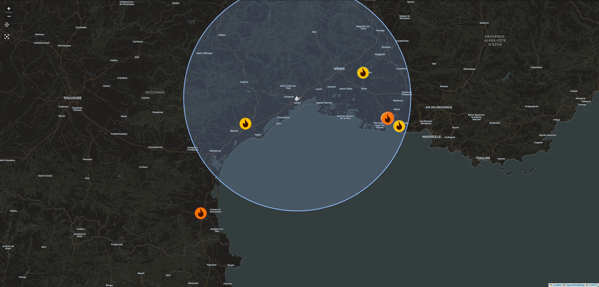

# NASA FIRMS Wildfire Monitor for Home Assistant

[](https://ko-fi.com/mrbenedict)

Near-real-time satellite wildfire detection from [NASA FIRMS](https://firms.modaps.eosdis.nasa.gov/)
(VIIRS + MODIS) as native Home Assistant entities: fires on the map card,
aggregate sensors, and everything you need for proximity alerts.

This grew out of a [zero-custom-code setup using `geo_json_events`](https://community.home-assistant.io/t/wildfire-monitoring-with-nasa-firms-live-fire-map-proximity-alerts-zero-custom-components/1016485)
and fixes what that approach structurally can't:

| | `geo_json_events` | this integration |
|---|---|---|
| FIRMS attributes (confidence, FRP, brightness, time, satellite) | dropped | preserved per fire |
| Multiple satellites | duplicate markers | deduplicated into one fire per ~1 km cluster |
| Filtering (min confidence / min FRP) | impossible | config option |
| Known heat sources (factories, flares) | always alarm | ignore zones |
| Area definition | hand-computed BBOX (`cos(radians(lat))` footgun) | pick location + radius on a map |
| MAP_KEY | visible in the entry title | stored in config data, never displayed |
| Polling | every 5 min | every 15 min, matching NASA's refresh cadence |
| Count / nearest-distance sensors | template DIY | built in, plus max FRP |
| Wind at the fire | not available | fetched at each fire's own coordinates, with the smoke-drift angle per fire |



*Live screenshot (dark theme, standard map card with `cluster: false`): seven
fires inside one monitored area in southern France, 30 July 2026. Each marker is
one logical fire — merged from up to three satellites — coloured by its fire
radiative power, yellow for low and orange for moderate. The circle is the
configured radius around the watched location.*

## Installation

**HACS** (recommended): HACS → Integrations → ⋮ → *Custom repositories* →
add `https://github.com/bangboomben/ha-nasa-firms` as *Integration* → install → restart.

**Manual**: copy `custom_components/nasa_firms` into your `config/custom_components/` and restart.

Requires Home Assistant **2025.6** or newer — that is where the map card gained
the `cluster` option the recommended card below depends on.

## Setup

1. Get a free MAP_KEY at <https://firms.modaps.eosdis.nasa.gov/api/map_key/>
   (rate limit 5 000 requests / 10 min — this integration uses a handful per 15 minutes).
2. Settings → Devices & Services → Add Integration → **NASA FIRMS Wildfire Monitor**.
3. Enter the key, drag the location pin onto the spot you want to watch, set
   the radius, choose satellites and filters. FIRMS splits the world into a
   dozen regional services, but which one covers your pin follows from the pin
   — there is nothing to pick, and nothing to get wrong.
4. Add a map card. The sensors appear on their own, but the fires are
   `geo_location` entities and Home Assistant does not build a dashboard out of
   them — until a card names the source, they have nowhere to show up:

   ```yaml
   type: map
   geo_location_sources:
     - nasa_firms
   entities:
     - zone.home
   default_zoom: 8
   cluster: false
   theme_mode: auto
   ```

   **`cluster: false` is the one line that is not the default**, and it matters:
   left on, the card merges markers that sit close together into a single disc
   with a count — so several fires become one blue bubble and their colours go
   with them, exactly when there is something to see.
   [What that costs and what the alternative looks like](docs/dashboard.md#the-map).

   A card with nothing on it but your home is the normal state, not a fault:
   it means nothing is burning inside your radius. `sensor.<name>_hotspots`
   says the same thing as a number.

5. To be told when a fire comes close, import the proximity-alert blueprint —
   pick the *Nearest hotspot* sensor, set a distance, choose the notification.
   [What it does and does not catch](docs/templates.md#proximity-alert).

   [](https://my.home-assistant.io/redirect/blueprint_import/?blueprint_url=https%3A%2F%2Fgithub.com%2Fbangboomben%2Fha-nasa-firms%2Fblob%2Fmain%2Fblueprints%2Fautomation%2Fnasa_firms%2Ffire_within_distance.yaml)

Satellites, detection window (24 h / 7 days), minimum confidence, minimum fire
radiative power and [ignore zones](#ignore-zones) can all be changed later via
the entry's *Configure* dialog.

**The radius tops out at 500 km.** FIRMS returns at most 1000 detections per
satellite per request, and a large enough area hits that ceiling — at which
point every count is too low with nothing about it looking wrong. If it is ever
reached anyway, a notice appears under Settings → System → **Repairs** saying so,
and the hotspot sensor carries the same fact as its `truncated` attribute.

## Ignore zones

FIRMS reports heat, not wildfires. A steel works, a flare stack or a smouldering
landfill is detected every single day, and nothing in the data distinguishes it
from a real fire — same pixel, same brightness, often the same confidence. The
person who lives there is the only one who knows.

So mark it: *Configure* → **Ignore zones** → **Add a zone**, drag the pin onto
the source, size the circle, save. Detections inside a zone are dropped before
anything else touches them, and the count shows up as `ignored_detections` on
the hotspot sensor so you can see a zone doing its job.

**A zone is a blind spot, and it does not know what it is hiding.** A real fire
starting next to your factory is invisible while it burns inside that circle.
Keep zones tight — they are capped at 20 km for exactly this reason.

There is deliberately **no automatic version**. "Ignore anything detected here
for many days running" sounds like the obvious feature, and it is the one thing
this must not do: a fire front burning for a week produces exactly that pattern.
Suppressing fires on a guess is not a trade this integration makes, so the list
stays manual and yours.

## Entities

Per config entry:

| Entity | Meaning |
|---|---|
| `sensor.<name>_hotspots` | Number of deduplicated fires in the radius (attributes: raw detections, per-satellite counts, fetch errors, `truncated`, `ignored_detections`) |
| `sensor.<name>_nearest_hotspot` | Distance to the closest fire (`unknown` when there is none). Attributes: `nearest_entity_id`, `bearing`, `direction`, `wind_bearing`, `wind_direction`, `wind_speed`, `smoke_offset` — `wind_speed` is the raw value in **m/s**, for calculating with |
| `sensor.<name>_wind_at_nearest_hotspot` | The same wind speed as an entity, so it carries its unit and follows your unit system (km/h on a metric instance, mph on a US one). Put this one on a dashboard |
| `sensor.<name>_max_fire_radiative_power` | Strongest fire in MW, with `strongest_entity_id` pointing at the fire it comes from |
| `geo_location.*` (source `nasa_firms`) | One entity per fire, with `bearing`, `direction`, `frp_mw`, `intensity`, `confidence`, `satellites`, `detections`, `brightness_k`, `acquired`, `origin` — plus `wind_bearing`, `wind_direction`, `wind_speed` and `smoke_offset` on the nearest fires ([see below](#wind-and-smoke-drift)) |

**The distance is not always in kilometres, and the fires always are.** The
nearest-hotspot sensor is a distance sensor, so Home Assistant shows it in your
instance's unit system — kilometres on a metric instance, **miles on a US one** —
and Settings → Entities lets you override that per entity. The fire entities
cannot follow: `geo_location` has no unit conversion, so their state is in
kilometres on every instance. Anything that prints the sensor's number should
take the unit from the entity rather than assume one:

```jinja

{{ states(s) }} {{ state_attr(s, 'unit_of_measurement') }}
```

**The sensor ids follow your Home Assistant language.** Home Assistant builds an
entity id from the entity's *translated* name, so the ids above are what an
English instance gets; a German one ends up with `sensor.<name>_nachster_hotspot`.
Every example in this repository uses the English form — check
Developer tools → States before copying one. The fire entities are unaffected:
their names are not translated, so they are
`geo_location.wildfire_hotspot_<lat>_<lon>` everywhere.

**A fire keeps its entity while it drifts.** Its id comes from the centroid of
the merged detections, which moves a little every refresh as satellites add and
drop pixels. Each cycle is matched against the previous one so an existing fire
hands its id down and stays the same entity, history included. Fires close
together keep their own ids — candidates are paired nearest-first and no id is
ever handed out twice. The matching starts over whenever the entry reloads
(a Home Assistant restart, or saving the options), but a fire that has not
drifted in the meantime gets the same id back from its coordinates anyway.

## Wind and smoke drift

The wind is fetched **at each fire's own coordinates** — not at your house,
which can sit in different weather entirely. The **three nearest fires** get a
reading each cycle (configurable up to five in the *Configure* dialog), and
each of them carries four attributes: `wind_bearing`, `wind_direction`,
`wind_speed`, and **`smoke_offset`** — the angle between where the wind pushes
the smoke and the line from that fire to you. `0°` means the smoke is being
pushed straight at you, `180°` straight away. With it, an automation can say
"fire within 20 km **and** drifting my way" instead of alerting on distance
alone — [the recipe](docs/templates.md#wind-at-the-fire).

Fires beyond that count simply lack the attributes. For any single one of
them, the `nasa_firms.get_wind` action returns the same values on demand:

```yaml
action: nasa_firms.get_wind
data:
  entity_id: geo_location.wildfire_hotspot_43_61_3_93
response_variable: wind
```

The count is a budget, not a tuning knob: every reading is one request to MET
Norway per refresh, and all installations of this integration share one
identity with their service. Five per cycle is where a thousand installations
still sit comfortably inside met.no's stated limits.

**This is geometry, not danger.** `smoke_offset` says where the air at the
fire is moving right now — not where the smoke ends up, and not whether you
are safe. Wind turns, slope and fuel matter as much, and a fire drifting away
is not a fire that is safe.
[The caveats in full](docs/templates.md#upwind-or-downwind-work-it-out-yourself).

## Recipes

The examples live next to the code rather than on this page, so they stay in
step with the version you installed:

- **[Dashboard](docs/dashboard.md)** — the map card, what the marker colours
  mean, showing two locations apart, and a complete card that explains every
  number it prints.
- **[Templates and automations](docs/templates.md)** — reading the nearest
  fire's attributes, the wind and smoke drift at any fire, a proximity alert,
  a watchdog for the data feed, and how to tell when your data is incomplete.

## Honest limitations

- **Not a real-time alarm.** VIIRS satellites pass ~2× per day each (three
  satellites shrink the gap to a few hours), plus up to ~3 h processing
  latency. This reliably answers *"where is it burning and how far from me"* —
  a freshly ignited fire can be invisible for hours. Pair it with your
  country's official warning channel (in Europe: the `meteoalarm` integration).
  **GDACS will not fill that gap** — the obvious neighbour covers drought,
  earthquake, flood, tropical cyclone, tsunami and volcano, and has no fire
  category at all. Someone in the community thread had been relying on it for
  exactly this. Regional feeds such as `nsw_rural_fire_service_feed` and
  `qld_bushfire_feed` do cover fire, but only their own corner of the world.
- FIRMS detects **thermal anomalies**, not wildfires. Factories, flares and
  landfills show up too. The confidence and FRP filters thin them out, and
  [ignore zones](#ignore-zones) remove the ones you know about by name.
- A hotspot is the center of a 375 m satellite pixel; expect a few hundred
  meters of positional tolerance.
- **The wind is a forecast, not a verdict.** It is looked up for the fire's grid
  cell, it turns, and terrain beats it. The integration reports observations and
  never scores your risk — `smoke_offset` is an angle, not a threat level —
  [the caveats are spelled out in full](docs/templates.md#upwind-or-downwind-work-it-out-yourself).

## Roadmap

- Protocol layer (`api.py`, intentionally free of HA imports) extracted to a
  PyPI package, then a Home Assistant Core submission alongside the existing
  geo-feed family (`nsw_rural_fire_service_feed`, `qld_bushfire_feed`, …)

## Questions, ideas and bugs

- **A question or an idea → the
  [community thread](https://community.home-assistant.io/t/wildfire-monitoring-with-nasa-firms-live-fire-map-proximity-alerts-zero-custom-components/1016485).**
  Nearly everything this integration does was decided there — the ignore zones,
  the wind at the fire and the intensity colours each started as somebody
  describing a problem. Other people read along and answer, which an issue
  cannot do, and no GitHub account is needed.
- **Something is broken →
  [open an issue](https://github.com/bangboomben/ha-nasa-firms/issues/new/choose).**
  The bug form asks for the diagnostics download, which is usually the whole
  difference between "it doesn't work" and a fix.
- **A feature request works on GitHub too** — there is a form for it and nobody
  gets sent away. A request is just a conversation before it is a task, so the
  thread tends to get there faster.

Whatever comes out of it lands in the release notes and in the candidate list
for the next version (`docs/`), including what was turned down and why.

## Support

This integration is free and always will be. If it earns a place on your
dashboard, you can [buy me a coffee](https://ko-fi.com/mrbenedict) ☕ — much
appreciated, never required.

**If you want to help those affected by wildfires:** the best place for your
money is not my coffee fund — it's the people fighting and recovering from
these fires. Consider the [IFRC](https://www.ifrc.org/) or your country's
Red Cross / civil protection. This project stays free either way.

## Credits & disclaimer

This integration was developed with the supporting help of AI tooling
(Claude Code). All changes are reviewed, tested against a live Home Assistant
instance, and maintained by a human.

Fire data courtesy of NASA FIRMS. This project is not affiliated with or
endorsed by NASA. We acknowledge the use of data and imagery from NASA's Fire
Information for Resource Management System (FIRMS), part of NASA's Earth
Science Data and Information System (ESDIS).

Wind data from [MET Norway](https://api.met.no/) (Norwegian Meteorological
Institute), used under [CC BY 4.0](https://creativecommons.org/licenses/by/4.0/)
and reduced to three values. This project is not affiliated with or endorsed by
MET Norway.

License: [MIT](LICENSE)
